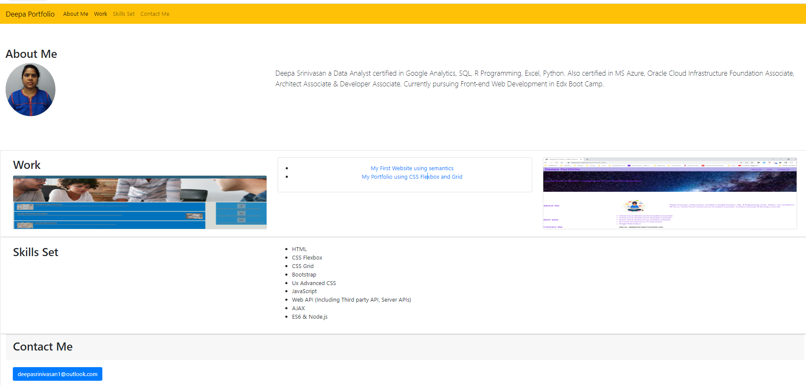

# my-portfolio-bootstrap

<picture> 
 
</picture>
## Description
This HTML Web application is a web page of my portfolio created using BootStrap as part of Week3 Bootcamp challenge to meet below user story acceptance criteria.

## Installation

N/A


## Usage

To use this web page, navigate to the above site using chrome browser.


### User Story

Using Bootstrap, recreate your portfolio site with the following items:

A navigation bar

A navigation menu at the top. Feel free to use Bootstrap's navbar or create your own.

Include links that are applicable to your portfolio.

Links should navigate to the appropriate sections

A hero section

A jumbotron featuring your picture, your name, and any other information you'd like to include.
A work section

A section displaying your work in grid.

If you need to use placeholder image use placehold.coLinks to an external site.

Use Bootstrap cards for each project.

The description should give a brief overview of the work.

Each project will eventually link to your class project work!

A skills section

List out the skills you expect to learn from the bootcamp.
An about/contact section

An About Me section in the same row.
A footer section

All hyperlinks should have a hover effect.

All buttons should display a box shadow upon hover.
```

### Acceptance Criteria

Satisfies all of the above acceptance criteria.